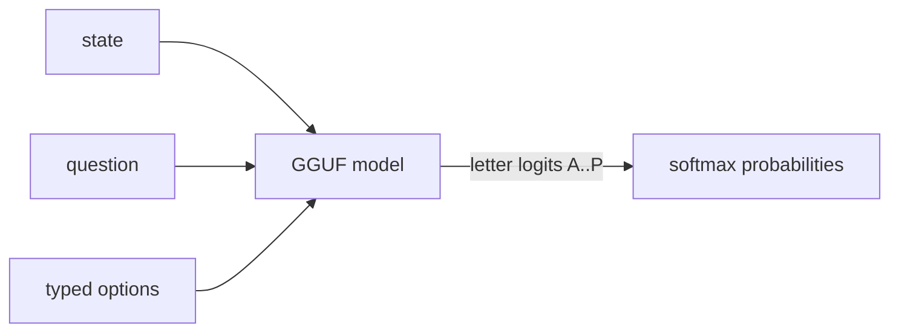

# Ereshkigal

**Semantic ifs in Rust** — typed option probabilities from open GGUF models via llama.cpp.

Inspired by [SemIf / OpenJev](https://github.com/TheoLeeCJ/SemIf-OpenJev). Independent project; **not affiliated with Jev or TypeSafe**.



## Why

Most agent decisions are small (`route this`, `retry that`). Chat models spend tokens generating JSON that software parses back into an `if`. Ereshkigal reads declared option-letter logits in one forward pass — no answer decoding.

## Quick start

```bash
# 1. Download the pinned GGUF (see manifests/default.json)
./scripts/download_gguf.sh

# 2. Build
cargo build --release -p ereshkigal

# 3. Score
./target/release/semif-score \
  --mode direct \
  --gguf models/Qwen3.5-4B-Q4_K_M.gguf \
  --input examples/decisions.jsonl \
  --output results/direct.jsonl
```

Modes:

| Mode | Flag | Behavior |
| --- | --- | --- |
| Direct | `--mode direct` | Fresh prefill per decision |
| Serial | `--mode serial` | Cache state prefix; restore per criterion |
| Shared | `--mode shared` | One prefill for identical state; branch restore |

## Tests

```bash
# Always (prompt hashes, validation, softmax)
cargo test -p ereshkigal-core --lib

# GGUF parity (needs download)
export ERESHKIGAL_GGUF="$PWD/models/Qwen3.5-4B-Q4_K_M.gguf"
cargo test -p ereshkigal-core --test parity_gguf -- --nocapture
```

Parity checks `prompt_sha256` (bit-exact vs HF tokenizer + SemIf prompt recipe), option argmax, and probabilities within `1e-4`. Serial vs shared must agree.

## Default model

Pinned in [`manifests/default.json`](manifests/default.json):

- Tokenizer: `Qwen/Qwen3.5-4B` @ `851bf6e806efd8d0a36b00ddf55e13ccb7b8cd0a`
- GGUF: `unsloth/Qwen3.5-4B-GGUF` / `Qwen3.5-4B-Q4_K_M.gguf`

Challenge candidates with `./scripts/bakeoff.sh` (see **Bakeoff**).


## Comparison vs SemIf

Head-to-head numbers: [`results/comparison.md`](results/comparison.md).

On SemIf’s 144 authored decisions, published **Qwen3.5-4B BF16** mean-family BA is **0.813**. Ereshkigal’s pinned **unsloth Q4_K_M** GGUF scores **0.854** family BA / **0.856** global BA on CPU; bartowski Q4_K_M (the GGUF SemIf documents) scores **0.787**. Weights and hardware differ — this is not a same-checkpoint A/B. CI’s Qwen3-0.6B Q8_0 scores **0.521** family BA vs SemIf’s published 0.6B BF16 **0.440**.

WANLI, TypeSafe-102, and perturbation sets are **not** scored in Ereshkigal yet.

## Bakeoff

Accuracy-first GGUF bakeoff on SemIf `authored144` (balanced accuracy). Candidates
are listed in `manifests/default.json` → `bakeoff_candidates`.

```bash
./scripts/bakeoff.sh
```

Writes `results/bakeoff.md` and updates the default GGUF pin to the BA winner.
Latency and serial/shared speedup on `fixtures/shared_state.jsonl` are secondary.

Latest pin: unsloth `Qwen3.5-4B-Q4_K_M` (BA ≈ 0.8556 on authored144).

## Calibration

Per-workload temperature scaling: `softmax(logits / T)`. Argmax is unchanged.

```bash
# Score with a known T
./target/release/semif-score --mode direct --gguf models/Qwen3.5-4B-Q4_K_M.gguf \
  --input fixtures/authored144.jsonl --output /tmp/pred.jsonl --temperature 1.116

# Fit T from gold + predictions
./target/release/semif-score calibrate \
  --gold fixtures/authored144.jsonl \
  --predictions /tmp/pred.jsonl \
  --report results/calibration/authored144.json
```

Committed fit for the bakeoff winner: `results/calibration/authored144.json`.

## CI smoke model

GitHub Actions (`.github/workflows/ci.yml`) always runs `ereshkigal-core` lib tests
and builds the CLI. The GGUF smoke job downloads the pinned **Qwen3-0.6B Q8_0**
(~640 MB) from `manifests/ci-smoke.json` and runs `parity_gguf` with
`ERESHKIGAL_SMOKE=1` against `fixtures/expected_smoke.jsonl`.

Quality scoring still uses the 4B default pin — CI’s 0.6B model is for cheap
prompt-hash / finite-prob / serial≡shared parity only.

## WebGPU demo

Static browser lab under [`webgpu-demo/`](webgpu-demo/):

```bash
cd webgpu-demo && python3 -m http.server 8080
# then open http://localhost:8080
python3 test_demo.py   # no GPU
```

Default browser model is Qwen3 0.6B; optional MiniCPM5 2B / Qwen3.5 4B. See
`webgpu-demo/README.md`.

## License

MIT. See [THIRD_PARTY.md](THIRD_PARTY.md) for SemIf/OpenJev and model notices.
