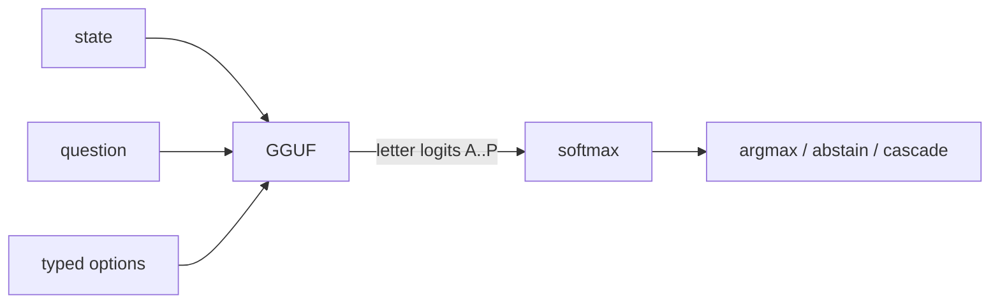
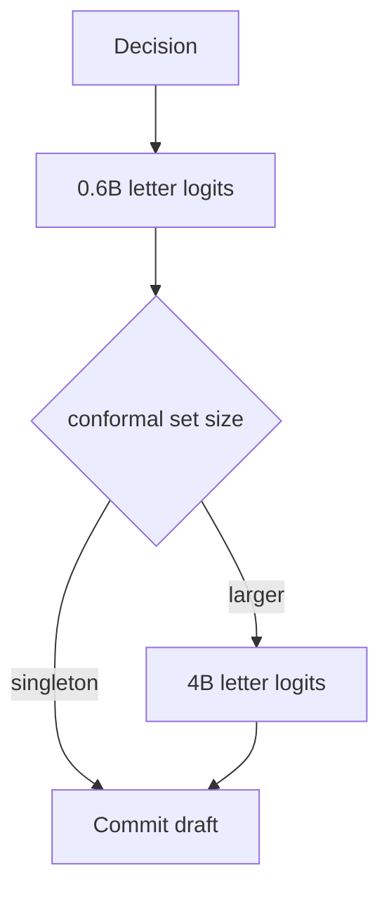

# Ereshkigal

**Semantic ifs in Rust.** Typed option probabilities from open GGUF models, in one forward pass. No JSON generation. No answer decoding.

Independent port and extension of **[SemIf / OpenJev](https://github.com/TheoLeeCJ/SemIf-OpenJev)** (MIT). Not affiliated with or endorsed by Jev, TypeSafe, or the SemIf authors. Star, cite, and support [SemIf](https://github.com/TheoLeeCJ/SemIf-OpenJev). They published the pattern, the gold sets, and the numbers we measure against.




## Why

Most agent "decisions" are tiny: route this, retry that, is the evidence enough? Chat models spend tokens writing JSON that you immediately parse back into an `if`. SemIf showed you can skip the decoder: pin a chat template, take last-position logits on the declared option letters, softmax. You get a distribution, not a string.

I wanted that interface as a standalone Rust crate. Embeddable, GGUF first, a small decision language on top, and not wired into Wordkeep or a game engine.

## What you get

- **Letter-logit readout, SemIf-compatible.** Same `direct-options-v1` recipe, bit-exact `prompt_sha256` vs Hugging Face tokenizers. On Qwen3-0.6B Q8, Python SemIf and Ereshkigal agree **144/144** argmax with max |Δp| ≈ 0 on authored144.
- **A decision language, not only a JSONL scorer.** `.esk` / TOML decrees, programs, abstain, conformal sets, tests, LSP. The runtime still never decodes answer tokens.
- **Serving modes.** Direct / serial / shared prefix reuse, optional cyclic permute, conformal 0.6B→4B cascade. Don't skip on raw 0.6B confidence.
- **Bakeoffs that stay honest.** Same-GGUF A/B vs SemIf is CI-gated on 0.6B. Qwen3.5-4B GGUF is **not** a tight Python/Rust match (hybrid KV / llama.cpp ABI). Unsloth Q4 vs SemIf's published BF16 is a **different checkpoint**. Do not quote that as "Rust is more accurate."
- **GPU numbers are a used GTX 1080 Ti (Vulkan).** On purpose. Current economic conditions; I am not buying a 3090 to look fast. Latency is still ~8× CPU on 4B Q4. See [benchmarks.md](benchmarks.md).




## Quick start

```bash
# 1. Pinned GGUF (see manifests/default.json)
./scripts/download_gguf.sh

# 2. Build
cargo build --release -p ereshkigal

# 3. Score
./target/release/semif-score \
  --mode direct \
  --gguf models/Qwen3.5-4B-Q4_K_M.gguf \
  --input examples/decisions.jsonl \
  --output results/direct.jsonl
```


| Mode   | Flag            | Behavior                                        |
| ------ | --------------- | ----------------------------------------------- |
| Direct | `--mode direct` | Fresh prefill per decision                      |
| Serial | `--mode serial` | Cache the state prefix; restore per criterion   |
| Shared | `--mode shared` | One prefill for identical state; branch restore |


GPU (Vulkan, after `./scripts/build_vulkan.sh`):

```bash
./target-vulkan/release/semif-score --n-gpu-layers 99 \
  --gguf models/Qwen3.5-4B-Q4_K_M.gguf \
  --input examples/decisions.jsonl --output results/direct.jsonl
```


## Examples

**JSONL** (`examples/decisions.jsonl`). One object per decision:

```json
{
  "id": "support-1",
  "state": "The deployment completed at 14:02 UTC. Health checks passed in all three zones.",
  "question": "Is there evidence that the deployment succeeded?",
  "options": [
    {"id": "yes", "description": "The deployment succeeded."},
    {"id": "no", "description": "The deployment did not succeed."},
    {"id": "insufficient", "description": "The evidence is insufficient to decide."}
  ]
}
```

Each result row is probabilities over those option ids (plus logits, prompt hash, timings). No generated tokens.

**Decrees** (`.esk`). Named questions you can test and chain:

```esk
decree deploy_ok "Is there evidence that the deployment succeeded?" {
  yes "The deployment succeeded."
  no "The deployment did not succeed."
  insufficient "The evidence is insufficient to decide."
  abstain coverage 0.8 => return
}

program example_release_gate(evidence) {
  let ok = deploy_ok(evidence)
  match ok {
    yes => "ship"
    no => "hold"
    insufficient => "page"
  }
}
```

```bash
./target/release/ereshkigal check decrees
./target/release/ereshkigal test --lib decrees --split all
```

Language docs: [docs/LANGUAGE.md](docs/LANGUAGE.md) · [docs/GRAMMAR.md](docs/GRAMMAR.md) · [docs/PACKAGES.md](docs/PACKAGES.md).

## Models

Pinned in `[manifests/default.json](manifests/default.json)`:


| Role               | Checkpoint                                                              |
| ------------------ | ----------------------------------------------------------------------- |
| Quality pin        | unsloth `Qwen3.5-4B-Q4_K_M` + tokenizer `Qwen/Qwen3.5-4B` @ `851bf6e8…` |
| CI / bit-exact A/B | `Qwen3-0.6B-Q8_0` (`manifests/ci-smoke.json`)                           |


`./scripts/bakeoff.sh` re-ranks GGUF candidates on SemIf `authored144` (balanced accuracy). Latest pin family BA ≈ **0.854** (CPU).

## Benchmarks

Tables, cascade, permute, and why the GPU is a 1080 Ti: **[benchmarks.md](benchmarks.md)**. Lab notes: `[results/comparison.md](results/comparison.md)`.

Headline: 0.6B same-GGUF vs Python SemIf is **144/144** bit-exact. Unsloth 4B Q4 CPU family BA **0.854**. Vulkan 4B on a GTX 1080 Ti is **~8×** CPU. SemIf's published 20 dec/s is a **3090 / BF16** number. We did not buy that card.

Fair A/B (isolated SemIf venv, not `training/.venv`):

```bash
./scripts/setup_semif_venv.sh
./scripts/ab_llamacpp.sh models/Qwen3-0.6B-Q8_0.gguf examples/decisions.jsonl
```

CI runs that 0.6B 3-row gate (max Δp < 1e-6). Do not put 4B Qwen3.5 in a 1e-6 probability gate.

Optional quality: `--debias permute` (cyclic option order; ~3× forwards, helps candidate_selection). `--debias pride` did not lift that family. Cascade: `semif-score cascade --routing conformal --gold …`.

## Tests

```bash
cargo test -p ereshkigal-lang --lib
cargo test -p ereshkigal-core --lib

export ERESHKIGAL_GGUF="$PWD/models/Qwen3-0.6B-Q8_0.gguf"
cargo test -p ereshkigal-core --test parity_gguf -- --nocapture
```

Operators beyond the SemIf surface: [docs/NOVEL.md](docs/NOVEL.md). Browser lab: [webgpu-demo/](webgpu-demo/).

## License

MIT. Notices for SemIf, llama.cpp, and model weights: [THIRD_PARTY.md](THIRD_PARTY.md).

If this is useful, support SemIf: [TheoLeeCJ/SemIf-OpenJev](https://github.com/TheoLeeCJ/SemIf-OpenJev). And the open models (Qwen) that make letter-logit scoring possible.

