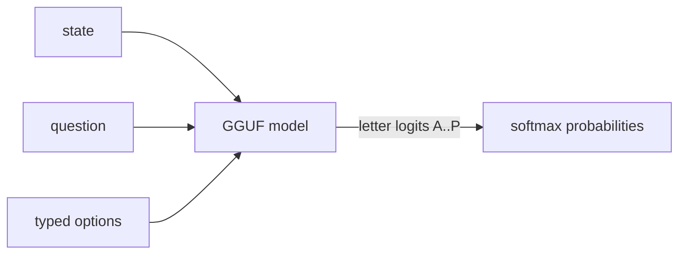

# Ereshkigal

**Semantic ifs in Rust** — typed option probabilities from open GGUF models via llama.cpp.

Inspired by [SemIf / OpenJev](https://github.com/TheoLeeCJ/SemIf-OpenJev). Independent project; **not affiliated with Jev or TypeSafe**.



## Why

Most agent decisions are small (`route this`, `retry that`). Chat models spend tokens generating JSON that software parses back into an `if`. Ereshkigal reads declared option-letter logits in one forward pass — no answer decoding.

## Quick start

```bash
# 1. Download the pinned GGUF (see manifests/default.json)
./scripts/download_gguf.sh

# 2. Build
cargo build --release -p ereshkigal

# 3. Score
./target/release/semif-score \
  --mode direct \
  --gguf models/Qwen3.5-4B-Q4_K_M.gguf \
  --input examples/decisions.jsonl \
  --output results/direct.jsonl
```

Modes:

| Mode | Flag | Behavior |
| --- | --- | --- |
| Direct | `--mode direct` | Fresh prefill per decision |
| Serial | `--mode serial` | Cache state prefix; restore per criterion |
| Shared | `--mode shared` | One prefill for identical state; branch restore |

## Tests

```bash
# Always (prompt hashes, validation, softmax)
cargo test -p ereshkigal-core --lib

# GGUF parity (needs download)
export ERESHKIGAL_GGUF="$PWD/models/Qwen3.5-4B-Q4_K_M.gguf"
cargo test -p ereshkigal-core --test parity_gguf -- --nocapture
```

Parity checks `prompt_sha256` (bit-exact vs HF tokenizer + SemIf prompt recipe), option argmax, and probabilities within `1e-4`. Serial vs shared must agree.

## Default model

Pinned in [`manifests/default.json`](manifests/default.json):

- Tokenizer: `Qwen/Qwen3.5-4B` @ `851bf6e806efd8d0a36b00ddf55e13ccb7b8cd0a`
- GGUF: `unsloth/Qwen3.5-4B-GGUF` / `Qwen3.5-4B-Q4_K_M.gguf`

Challenge candidates with `./scripts/bakeoff.sh`.

## License

MIT. See [THIRD_PARTY.md](THIRD_PARTY.md) for SemIf/OpenJev and model notices.
